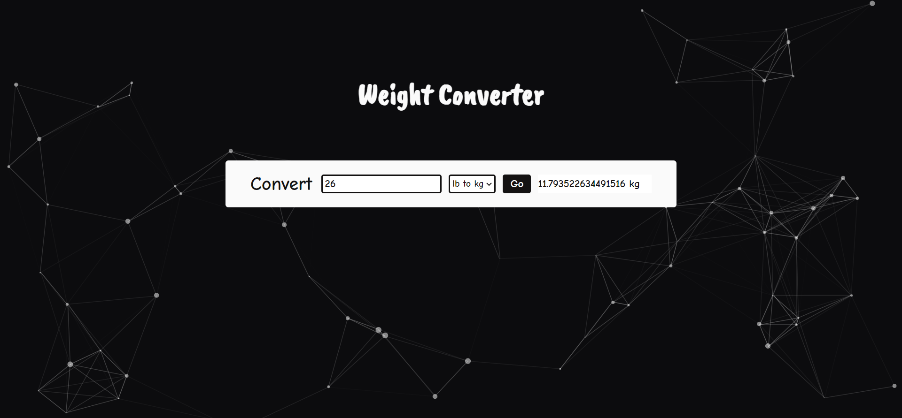

# Weight Converter

Weight Converter Website.
 
 ## Functionality
 
 Converts weight from Kilograms to Pounds or Pounds to Kilograms.
 
 ## Constraints
 
 Create html and write a function convert() in js file that takes the value in the text input and 
 converts it from either from kilograms to pounds or from pounds to kilograms depending on the 
 dropdown box.  
 The result should be displayed in the empty span.  
 The conversion factors:  
 1 pound = 0.4536 kilograms, and 
 1 kilogram = 2.2046 pounds.

## Technologies Used

Technologies used in this project are HTML, SCSS and vanilla JavaScript.

## Link

- [Live Site URL](https://afreenalam198.github.io/weightConverter)

## Screenshot

 
 
